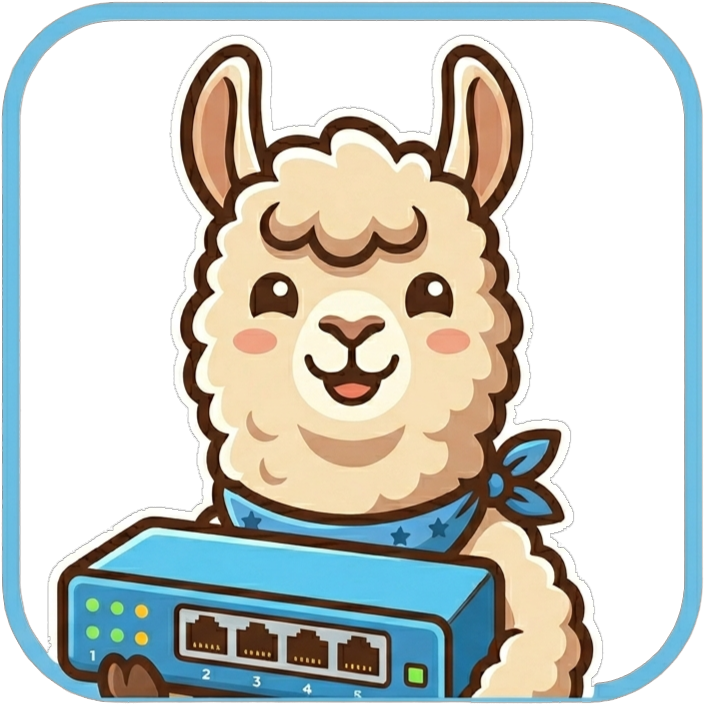
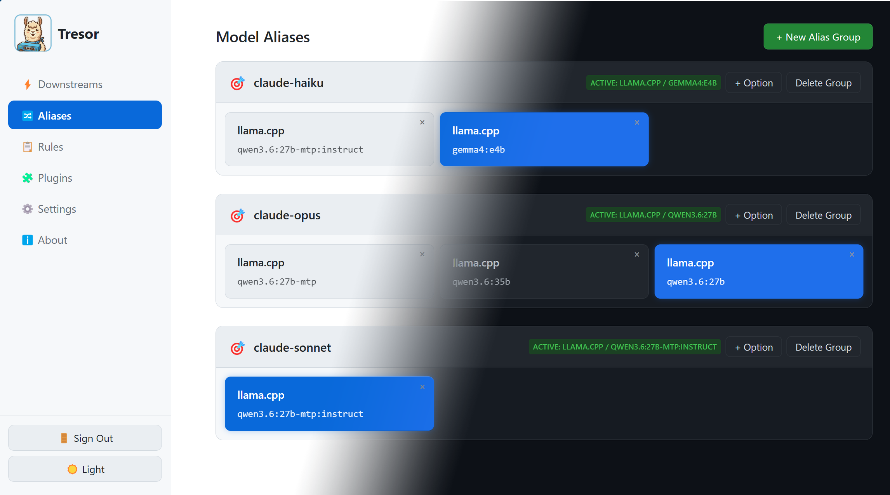
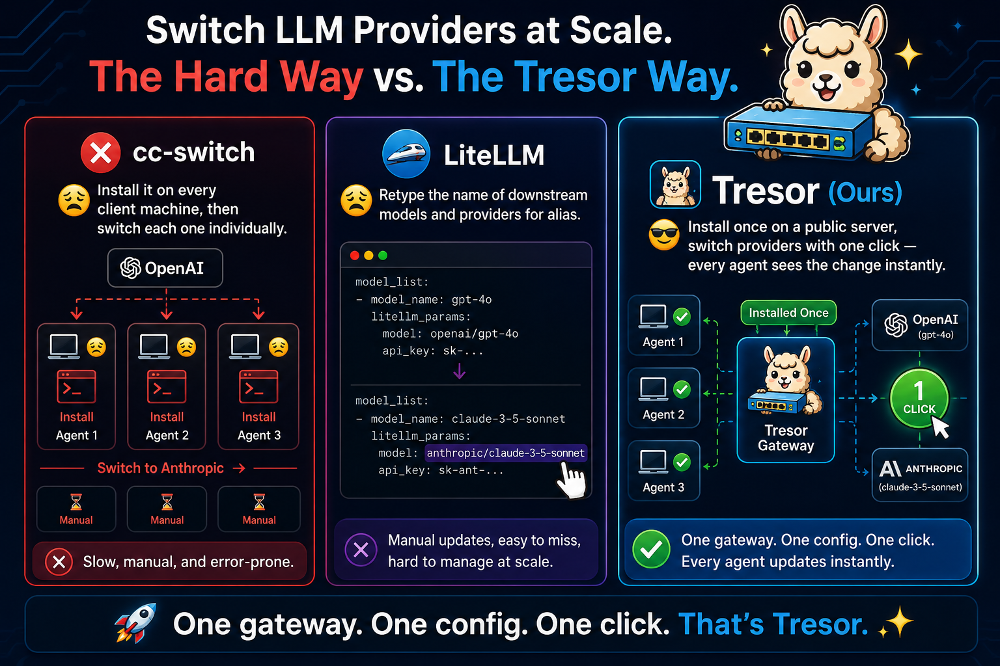

<div align="center">

# Tresor

> **A single-binary LLM gateway for switching providers at scale with one click.**

**One gateway, One config, One click**



[](https://go.dev/)
[](LICENSE)



</div>


## 🤔 Why Tresor?

- **One gateway**: No need to install on every PC/server where LLM apps live in.
- **One config**: All LLM apps do not need to reconfigure their LLM providers.
- **One click**: LLM provider switch via alias buttons in web UI.

||Tresor (Ours)|[cc-switch](https://github.com/farion1231/cc-switch)|[LiteLLM](https://github.com/BerriAI/litellm)
|---|---|---|---|
|One gateway|✅|❌(install on every PC)|✅|
|One config|✅|✅|✅|
|One click|✅|✅|❌(retype model name)|

### 🔄 The Problem: Switching Providers at Scale

Imagine you have agents on three machines, all calling OpenAI. You want to switch them to Anthropic.



⚠ DISCLAIMER: Tresor is intended for personal use rather than LLM transfer stations, so it only have one administrative account. We are not planning to support commercial-purpose multi-user login.

## ⚡ What Tresor Does

Tresor is a single binary with two modes:

| Mode | What It Does |
|------|-------------|
| **Daemon** | 🖥️ Long-running HTTP gateway + admin REST API + embedded web UI |
| **CLI** | 💻 Command-line client for managing the daemon |

```
┌──────────────┐     ┌──────────────┐     ┌──────────────┐
│   Your App   │────>│    Tresor    │────>│  LLM Provider│
│              │     │    (gateway) │     │  (OpenAI,    │
│              │<────│              │<────│  Anthropic..) │
└──────────────┘     └──────────────┘     └──────────────┘
                         │
                         ├── Admin REST API
                         ├── Embedded Web UI
                         └── CLI Commands
```

### Key Capabilities

- ⚡ **Hot-Switch Models** — Map one model name to any backend model and switch on the fly. Your app requests `gpt-4o`; Tresor can route it to Claude Sonnet, Opus, or keep it on GPT-4o — all without restarting.
- 🔄 **Protocol Translation** — Convert between OpenAI and Anthropic API formats transparently. Your app sends an OpenAI request; Tresor forwards it to Anthropic and converts the response back. No code changes needed.
- 🔌 **Plugin Pipeline** — Chain transformation plugins per rule (header injection, compatibility fix, format conversion, and more).
- 🛤️ **Per-Path Routing** — Route different API paths (and models) to different providers based on configurable rules.
- 🌐 **Embedded Web UI** — Manage everything from a browser dashboard. No separate frontend deployment.
- 📝 **Single Config File** — All settings in one portable YAML file. Changes via the web UI write back automatically.


## 🚀 Getting Started

> Warning: the program is heavily vibe-coded, but the author has tried the best to follow software engineering practices to ensure its quality. Use with caution.

### Install

**Linux / macOS** — download the latest release with one command:

```bash
curl -fsSL https://raw.githubusercontent.com/Ladbaby/Tresor/main/setup.sh | bash
```

This installs the binary to `~/.local/bin/tresor` and creates a config skeleton at `~/.config/tresor/config.yaml`.

**Windows** — download a release binary manually from [GitHub Releases](https://github.com/Ladbaby/Tresor/releases).

### Configure

- Option 1: Configure later via web UI.
- Option 2: Edit `~/.config/tresor/config.yaml`.

> Change bind_addr to 0.0.0.0:11510 if you want the server to be publicly available.

### Start

```bash
# Start the daemon
tresor run --config ~/.config/tresor/config.yaml

# Point your LLM apps to: http://127.0.0.1:11510
# Open the web UI: http://127.0.0.1:11510 in your browser
```

### Run as Systemd Service (Linux)

Run Tresor as a user-level systemd service — no `sudo` needed, auto-starts on login:

```bash
# 1. Create the user service unit
mkdir -p ~/.config/systemd/user
cat > ~/.config/systemd/user/tresor.service << EOF
[Unit]
Description=Tresor LLM Gateway

[Service]
Type=simple
ExecStart=$HOME/.local/bin/tresor run --config $HOME/.config/tresor/config.yaml
WorkingDirectory=$HOME/.config/tresor
Restart=on-failure
RestartSec=5

# Environment (uncomment as needed)
# Environment=HTTP_PROXY=http://proxy.example.com:8080
# Environment=HTTPS_PROXY=http://proxy.example.com:8080

[Install]
WantedBy=default.target
EOF

# 2. Enable and start the service
#    (--user creates a service under your user session)
systemctl --user daemon-reload
systemctl --user enable --now tresor.service

# 3. Check status
systemctl --user status tresor

# View logs
journalctl --user -u tresor -f
```

> **Note:** If you installed Tresor to a different path, update `ExecStart` and `WorkingDirectory` accordingly.

### Build from Source

For developers or unsupported platforms (requires Go 1.26+):

```bash
go build -o tresor .
```

See the [Installation](https://ladbaby.github.io/tresor-docs/docs/user/getting-started/installation) docs for full instructions.

## 📚 Documentation

Full documentation is available at **[ladbaby.github.io/tresor-docs/](https://ladbaby.github.io/tresor-docs/)**:

### 👤 For Users
- [🏠 Introduction](https://ladbaby.github.io/tresor-docs/docs/user/intro) — overview and architecture
- [📦 Installation & Quick Start](https://ladbaby.github.io/tresor-docs/docs/user/getting-started/installation) — install from release or source, configure, run
- [⚙️ Configuration Basics](https://ladbaby.github.io/tresor-docs/docs/user/configuration/basics) — YAML config file reference
- [🔗 Downstreams](https://ladbaby.github.io/tresor-docs/docs/user/configuration/downstreams) — configure LLM provider endpoints
- [📏 Rules](https://ladbaby.github.io/tresor-docs/docs/user/configuration/rules) — define routing rules with transform pipelines
- [🏷️ Model Aliases](https://ladbaby.github.io/tresor-docs/docs/user/configuration/aliases) — map model names and hot-switch backends
- [🌐 Proxy Modes](https://ladbaby.github.io/tresor-docs/docs/user/configuration/proxy-modes) — outbound proxy configuration
- [🖥️ Web UI Guide](https://ladbaby.github.io/tresor-docs/docs/user/web-ui) — manage everything from the browser
- [💻 CLI Reference](https://ladbaby.github.io/tresor-docs/docs/user/cli-reference) — all command-line commands

### 💡 Use Cases
- [🔄 Transparent Provider Switching](https://ladbaby.github.io/tresor-docs/docs/user/use-cases/provider-switching) — route OpenAI-format traffic to Anthropic
- [🎛️ Model Aliasing](https://ladbaby.github.io/tresor-docs/docs/user/use-cases/model-aliasing) — hot-switch between backends
- [⚖️ A/B Testing Backends](https://ladbaby.github.io/tresor-docs/docs/user/use-cases/ab-testing) — compare providers side by side

### 🛠️ For Developers
- [🏗️ Architecture](https://ladbaby.github.io/tresor-docs/docs/dev/architecture) — codebase structure, request flow, data layer
- [🔌 Plugin System](https://ladbaby.github.io/tresor-docs/docs/dev/plugin-system) — building custom transformers
- [🧪 Testing](https://ladbaby.github.io/tresor-docs/docs/dev/testing) — test strategy and coverage
- [🤝 Contributing](https://ladbaby.github.io/tresor-docs/docs/dev/contributing) — how to contribute to Tresor


## 📜 Acknowledgement

- [llama.cpp](https://github.com/ggml-org/llama.cpp): Memory saving LLM inference.
- [Qwen & Unsloth](https://huggingface.co/unsloth/Qwen3.6-27B-MTP-GGUF): High quality local LLM.
- [Google Gemini](https://gemini.google.com/): Icon creation.
- [OpenAI ChatGPT](https://chatgpt.com/): Comparison figures.
